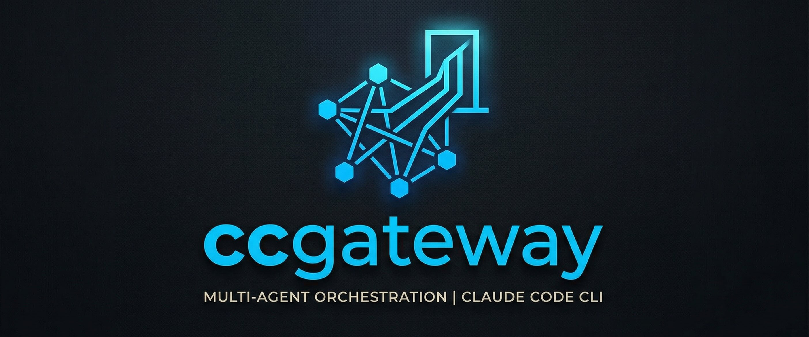

<p align="center">
  
</p>

# ccgateway

**An orchestration agent for Claude Code.**

ccgateway is a single Node.js process that orchestrates multiple Claude Code agents — routing messages between Discord, Slack, and the CLI, assembling context per turn, spawning long-running tasks into tmux, and letting agents talk to each other. No API keys, no third-party harness, no persistent agent processes. Just `claude --print` invoked with the right context, in the right workspace, at the right moment.

## Why orchestration?

Claude Code is stateless — great at one turn at a time in one directory. ccgateway is the layer above it: it decides *which* agent should answer, *where* that agent lives, *what* context it needs, and *how* to fan work out across async tasks and other agents.

- **Route** — Discord/Slack/CLI messages → the right agent based on channel bindings
- **Assemble** — Identity files + conversation history + skills + memory → one `--append-system-prompt` payload
- **Persist** — JSONL sessions per agent-per-channel, never expire, context-windowed automatically
- **Spawn** — Long-running work dispatched to detached tmux sessions you can attach to live
- **Coordinate** — Agents message each other through their own channels, with their own avatars
- **Extend** — Gateways are plugins; implement one interface to add Telegram, WhatsApp, or anything else

Every AI invocation is a fresh `claude --print`. No memory leaks, trivial crash recovery, and you can change models per turn. Concurrency is bounded only by your Claude Code subscription.

## Quick Start

```bash
npm install -g ccgateway
ccg init

# Add bot tokens to ~/.ccgateway/.env
# DISCORD_SALT_TOKEN=...
# SLACK_PEPPER_TOKEN=...

ccg install                                   # systemd user service (recommended)
# or
source ~/.ccgateway/.env && ccg start         # foreground
```

See [Installation](docs/getting-started/installation.md) and [Quick Start](docs/getting-started/quick-start.md) for the full walkthrough.

### Service management

```bash
ccg install                         # install + start as systemd user service
ccg uninstall                       # stop + remove

systemctl --user status  ccgateway
systemctl --user restart ccgateway
journalctl --user -u ccgateway -f
```

`loginctl enable-linger $USER` keeps the service alive after logout.

## How it works

```
┌──────────────────────────────────────────────┐
│            ccgateway (single process)        │
│                                              │
│  ┌─────────┐  ┌─────────┐  ┌─────────────┐   │
│  │ Discord │  │  Slack  │  │   Future    │   │
│  │ Plugin  │  │ Plugin  │  │   Plugins   │   │
│  └────┬────┘  └────┬────┘  └──────┬──────┘   │
│       └────────────┼──────────────┘          │
│                    ↓                         │
│            ┌──────────────┐                  │
│            │    Router    │                  │
│            │  (bindings)  │                  │
│            └──────┬───────┘                  │
│                   ↓                          │
│           ┌───────────────┐                  │
│           │  Session Mgr  │                  │
│           │ (JSONL state) │                  │
│           └───────┬───────┘                  │
│                   ↓                          │
│          ┌─────────────────┐                 │
│          │ Context Builder │                 │
│          │ identity+history│                 │
│          │ +skills+memory  │                 │
│          └────────┬────────┘                 │
│                   ↓                          │
│          ┌─────────────────┐                 │
│          │  claude --print │                 │
│          └─────────────────┘                 │
└──────────────────────────────────────────────┘
```

For each turn: a plugin receives a message → router matches channel to agent → session manager loads the JSONL → an optional Haiku triage call decides sync-vs-async → context builder assembles the system prompt → `claude --print` runs in the agent's workspace → response is appended to the session and posted back. Full lifecycle in [Architecture](docs/concepts/architecture.md).

## Capabilities

### Multi-agent identities

Each agent is a workspace directory with its own identity files. ccgateway points Claude Code at the right workspace — identity lives in your files, not in ccgateway config.

```bash
ccg agents add --id salt --name Salt --workspace ~/clawd-salt --model claude-opus-4-6 --emoji "🧂"
ccg agents list
```

Claude Code reads `CLAUDE.md` automatically. ccgateway also injects `SOUL.md`, `IDENTITY.md`, `AGENTS.md`, plus today's and yesterday's daily logs. More in [Agents](docs/concepts/agents.md).

### Discord & Slack gateways

Each agent can have its own Discord bot (avatar and name) bound to specific channels. Slack uses socket mode — no public URL needed.

```json
{
  "bindings": [
    { "agent": "salt",   "gateway": "discord", "channel": "1465736400014938230", "bot": "salt" },
    { "agent": "pepper", "gateway": "slack",   "channel": "C07ABC123",          "bot": "pepper" }
  ]
}
```

In-channel slash commands: `/new`, `/reset`, `/status`. Gateway-specific setup in [Discord](docs/gateways/discord.md) and [Slack](docs/gateways/slack.md).

### Session persistence

One JSONL file per agent-per-channel. Sessions never expire. When history exceeds the token budget (default 200k), older messages drop from what gets sent to Claude, but the full log stays on disk.

```bash
ccg sessions list
ccg sessions inspect salt:discord:1465736400014938230
ccg sessions reset   salt:discord:1465736400014938230
```

### Async task spawning

A Haiku triage classifies each incoming message as sync or async. Async work launches `claude` in interactive mode inside a detached tmux session with full tool access — you can attach live to watch or intervene. When the session ends, results are posted back to the channel.

```bash
tmux list-sessions
tmux attach -t <task-session>
```

Details in [Async Tasks](docs/features/async-tasks.md).

### Cross-agent messaging

Agents coordinate by posting to each other's channels. Salt messaging Pepper looks identical to a human posting in Pepper's channel — same avatar, same routing.

```bash
ccg send pepper "RCA done for NHD-10763" --from salt
```

Agents without gateway bindings fall back to a file-based inbox. See [Cross-Agent Messaging](docs/features/cross-agent-messaging.md).

### Skills

Markdown files with agent-readable instructions. Shared skills available to everyone; agent-specific skills override shared ones.

```bash
ccg skills list
ccg skills add deploy-to-staging.md
ccg skills add navix-rca.md --agent salt
```

More in [Skills](docs/features/skills.md).

### CLI chat

Test agents locally without Discord or Slack — same session, same context, same identity:

```bash
ccg chat salt
```

Or drop into an orchestrated subagent session with full identity injection from inside Claude Code via the `/talk` skill.

## Plugin architecture

Gateways are plugins. Discord and Slack ship as built-ins. Add a new gateway by implementing one interface:

```typescript
interface CcgPlugin {
  name: string;
  type: 'gateway' | 'skill' | 'tool';
  init(core: CcgCore): Promise<void>;
  start?(): Promise<void>;
  stop?(): Promise<void>;
}
```

Full guide: [Building a Plugin](docs/guides/building-a-plugin.md).

## Migration from OpenClaw

```bash
ccg migrate openclaw [--config <path>] [--dry-run]
```

Agents, bindings, tokens, and skills carry over. See [Migrating from OpenClaw](docs/guides/migrating-from-openclaw.md).

## Configuration

Config lives at `~/.ccgateway/config.json` (or `$CCG_HOME/config.json`). Reference: [config.md](docs/reference/config.md), [environment.md](docs/reference/environment.md), [troubleshooting.md](docs/reference/troubleshooting.md).

```bash
ccg agents list
ccg sessions list
ccg skills list
ccg status
```

## Roadmap

- **Telegram gateway** — Plugin for Telegram bot API
- **WhatsApp gateway** — Plugin for WhatsApp Business API
- **Browser tools** — Playwright-based browser interaction plugin
- **Shared skill packs** — Pre-built skill collections
- **Token-accurate context budgeting** — Replace chars/4 estimation with a real tokenizer

## Docs

Full documentation under [`docs/`](docs/index.md):

- [Getting Started](docs/getting-started/installation.md)
- [Concepts](docs/concepts/architecture.md) — architecture, agents, sessions, plugins, context
- [Features](docs/features/async-tasks.md) — async tasks, cross-agent messaging, skills, memory, CLI chat
- [Gateways](docs/gateways/discord.md) — Discord, Slack
- [Guides](docs/guides/creating-an-agent.md) — creating agents, writing skills, building plugins, migration
- [CLI Reference](docs/cli/reference.md)

## License

MIT
